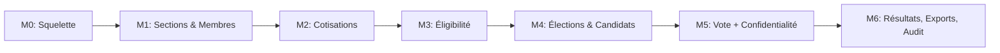

# MILESTONES.md — Plan de livraison par étapes

**Version :** 1.0 (MVP)
**Dernière mise à jour :** 2026-02-07

---

## Vue d'ensemble

```
M0 → M1 → M2 → M3 → M4 → M5 → M6
│      │      │      │      │      │      │
│      │      │      │      │      │      └─ Résultats, Exports, Logs, Audit
│      │      │      │      │      └─ Vote + Confidentialité
│      │      │      │      └─ Élections & Candidats
│      │      │      └─ Éligibilité (calcul)
│      │      └─ Cotisations
│      └─ Sections & Membres
└─ Squelette & Base UI
```

Chaque milestone **dépend du précédent**. Ne pas commencer M(n+1) avant la DoD de M(n).

---

## M0 — Squelette & Base UI

### Objectif

Mettre en place le socle technique : projet React+TS+MUI, routing, layouts, auth, thème.

### Livrables

- [ ] Monorepo `pnpm` initialisé avec workspaces
- [ ] Structure `apps/web` + `functions` en place
- [ ] Projet Vite + React + TypeScript initialisé
- [ ] MUI installé et thème configuré (palette, typo)
- [ ] React Router v6 : routes publiques / membre / admin
- [ ] Layout Membre : bottom nav (mobile) + sidebar légère (desktop)
- [ ] Layout Admin : sidebar permanente (desktop) + drawer (mobile)
- [ ] Firebase Auth : inscription, connexion, déconnexion, vérification email
- [ ] Guard de route : redirection si non connecté / mauvais rôle
- [ ] Pages vides (placeholder) pour chaque écran principal
- [ ] Firebase Emulator Suite configurée
- [ ] Scripts racine `pnpm dev`, `pnpm build`, `pnpm deploy` configurés
- [ ] ESLint + Prettier configurés
- [ ] Vitest configuré (1 test "hello world")

### Critères d'acceptation

- F: A1, A2, A3, A4, A5 (voir ACCEPTANCE.md)
- L1, L3, L4 (responsive, loading, erreurs)
- T1-T3 (voir ACCEPTANCE.md : init technique + branding MODEL)

### Prompt template

```
Objectif : Implémenter Milestone M0 — Squelette & Base UI
Contraintes : Respecter docs/UX_UI.md (thème, navigation), docs/DEPLOYMENT.md (firebase config)
Livrables : Setup complet + auth + layouts + routing + pages vides
DoD : TS sans erreur, lint OK, emulators fonctionnels, responsive
```

---

## M1 — Sections & Membres

### Objectif

CRUD sections, gestion des membres, fiche membre détaillée.

### Dépendances

- M0 terminé (auth + layouts fonctionnels)

### Livrables

- [ ] Collection `sections/` : CRUD complet (admin)
- [ ] Page admin : liste des sections (table + actions)
- [ ] Collection `members/` : création par admin
- [ ] Page admin : liste des membres (table riche avec recherche, filtres, pagination)
- [ ] Page admin : fiche membre (profil, statut)
- [ ] Page membre : "Mon profil" (lecture + modification champs autorisés)
- [ ] Statuts membres : `pending` → `active` → `suspended`
- [ ] Cloud Functions : `createMember`, `updateMember`, `createSection`, `updateSection`, `deleteSection`
- [ ] Audit logs : `member.create`, `member.update`, `member.suspend`, `section.create`, `section.update`, `section.delete`
- [ ] Tests unitaires + intégration
- [ ] Firestore rules pour `members/` et `sections/`

### Critères d'acceptation

- B1-B6, C1-C7 (voir ACCEPTANCE.md)

### Prompt template

```
Objectif : Implémenter Milestone M1 — Sections & Membres
Contraintes : Respecter docs/DATA_MODEL.md (collections members, sections) + docs/RBAC_SECURITY.md (permissions)
Livrables : Pages admin (sections + membres) + Cloud Functions + règles Firestore + tests
DoD : TS sans erreur, lint OK, tests OK, audit logs, responsive
```

---

## M2 — Cotisations

### Objectif

Politique de cotisation configurable, enregistrement des paiements, calcul "à jour / en retard".

### Dépendances

- M1 terminé (membres + fiche membre)

### Livrables

- [ ] Collection `contributionPolicies/` : CRUD (SuperAdmin)
- [ ] Page admin : politique de cotisation (formulaire + historique)
- [ ] Collection `payments/` : enregistrement (append-only)
- [ ] Page admin fiche membre : onglet Cotisations (historique + bouton "Enregistrer")
- [ ] Modal : enregistrement paiement (montant, période, référence, note)
- [ ] Calcul automatique "à jour / en retard" basé sur politique + tolérance
- [ ] Badge visuel : "À jour" (vert) / "En retard" (rouge) dans la liste membres
- [ ] Cloud Functions : `setContributionPolicy`, `recordPayment`
- [ ] Firestore rules : payments append-only (no update, no delete)
- [ ] Audit logs : `payment.record`, `policy.update`, `policy.create`
- [ ] Tests unitaires : `isContributionUpToDate` (tous les cas)
- [ ] Tests intégration : `recordPayment`, Firestore rules

### Critères d'acceptation

- E1-E8 (voir ACCEPTANCE.md)

### Prompt template

```
Objectif : Implémenter Milestone M2 — Cotisations
Contraintes : Respecter docs/DATA_MODEL.md (payments, contributionPolicies) + docs/RBAC_SECURITY.md
Livrables : Pages admin + Cloud Functions + calcul à jour/en retard + tests + audit logs
DoD : TS sans erreur, tests OK, payments append-only vérifié, responsive
```

---

## M3 — Éligibilité

### Objectif

Conditions paramétrables, validation par admin, calcul d'éligibilité (voter / candidater).

### Dépendances

- M2 terminé (cotisations + calcul "à jour")

### Livrables

- [ ] Collection `conditions/` : catalogue (Admin/SuperAdmin)
- [ ] Page Admin : gestion des conditions (table + CRUD)
- [ ] Collection `memberConditions/` : validation par admin
- [ ] Page admin fiche membre : onglet Conditions (checklist + historique)
- [ ] Cloud Function : `computeEligibility` (voter + candidater)
- [ ] Page membre : "Mon éligibilité" (checklist visuelle ✅/⏳/❌ + raisons)
- [ ] Cloud Functions : `createCondition`, `updateCondition`, `validateCondition`
- [ ] Gestion de l'expiration des conditions (`expiresAt`)
- [ ] Audit logs : `condition.create`, `condition.validate`, `condition.invalidate`
- [ ] Tests unitaires : `computeEligibility` (tous les cas)
- [ ] Tests intégration : Cloud Functions conditions

### Critères d'acceptation

- D1-D7 (voir ACCEPTANCE.md)

### Prompt template

```
Objectif : Implémenter Milestone M3 — Éligibilité
Contraintes : Respecter docs/DATA_MODEL.md + docs/FUNCTIONS_API.md (computeEligibility)
Livrables : Catalogue conditions + checklist membre + calcul éligibilité + tests
DoD : TS sans erreur, 100% couverture sur computeEligibility, responsive
```

---

## M4 — Élections & Candidats

### Objectif

Cycle de vie des élections (draft → open → closed → published), gestion des candidats.

### Dépendances

- M3 terminé (éligibilité calculable)

### Livrables

- [ ] Collection `elections/` : création via wizard (4 étapes)
- [ ] Page admin : liste des élections (table + filtres)
- [ ] Wizard de création : infos générales → dates → règles → récapitulatif
- [ ] Sous-collection `candidates/` : ajout, validation, rejet
- [ ] Page admin : gestion des candidats (par élection)
- [ ] Vérification éligibilité candidat automatique
- [ ] Ouverture d'élection : verrouillage + randomisation ordre candidats + calcul éligibles
- [ ] Fermeture d'élection : manuelle + scheduled function `autoCloseElection`
- [ ] Cloud Functions : `createElection`, `updateElection`, `openElection`, `closeElection`, `addCandidate`, `validateCandidate`, `removeCandidate`
- [ ] Audit logs pour toutes les actions élection/candidat
- [ ] Tests unitaires : validation dates, vérification candidat
- [ ] Tests intégration : cycle de vie complet

### Critères d'acceptation

- F1-F9, G1-G5 (voir ACCEPTANCE.md)

### Prompt template

```
Objectif : Implémenter Milestone M4 — Élections & Candidats
Contraintes : Respecter docs/DATA_MODEL.md + docs/FUNCTIONS_API.md + docs/UX_UI.md (wizard)
Livrables : Wizard élection + candidats + verrouillage + scheduled close + tests
DoD : TS sans erreur, tests OK, wizard responsive, audit logs
```

---

## M5 — Vote + Confidentialité

### Objectif

Système de vote confidentiel avec jetons, anti-triche, deadline stricte.

### Dépendances

- M4 terminé (élection ouvrable + candidats)

### Livrables

- [ ] Page membre : élection en cours (cartes candidats + bouton voter)
- [ ] Modal de confirmation avant vote
- [ ] Page de confirmation "Vote enregistré"
- [ ] Cloud Function `castVote` (transaction complète — voir FUNCTIONS_API.md)
- [ ] Système de jetons : génération + tokenIndex + ballots anonymes
- [ ] Vérifications serveur : éligibilité, deadline, double vote, candidat valide
- [ ] Compteur participation temps réel (admin : %, nombre)
- [ ] Firestore rules : `ballots/` et `tokenIndex/` inaccessibles côté client
- [ ] Log `vote.cast` SANS candidateId
- [ ] Tests unitaires : génération jetons
- [ ] Tests intégration : `castVote` (tous les cas — voir TEST_PLAN.md)
- [ ] Tests E2E : flux vote complet (inscription → vote → confirmation)

### Critères d'acceptation

- H1-H12 (voir ACCEPTANCE.md) — **TOUS** obligatoires

### Prompt template

```
Objectif : Implémenter Milestone M5 — Vote + Confidentialité
Contraintes : Respecter docs/FUNCTIONS_API.md (castVote), docs/RBAC_SECURITY.md (séparation données)
Livrables : Page vote + castVote function + jetons + anti-triche + tests
DoD : 100% couverture castVote, Firestore rules testées, aucune fuite de données, responsive
```

---

## M6 — Résultats, Exports, Logs & Audit

### Objectif

Publication des résultats, exports CSV/PDF, écran logs, audit break-glass.

### Dépendances

- M5 terminé (votes enregistrés)

### Livrables

- [ ] Cloud Function `publishResults` : calcul + écriture `results/`
- [ ] Page membre : résultats (graphique + tableau)
- [ ] Page admin : résultats + participation + export
- [ ] Export CSV et PDF (Cloud Functions)
- [ ] Page admin : logs (table chronologique + filtres)
- [ ] Page SuperAdmin : gestion des admins (promouvoir/révoquer)
- [ ] Page SuperAdmin : audit break-glass (recherche + motif + résultat)
- [ ] Cloud Functions : `publishResults`, `getResults`, `exportResults`, `exportEligibleVoters`
- [ ] Cloud Functions audit : `auditCheckVoter`, `auditRevealVote`, `auditExportBallots`
- [ ] Cloud Function : `getAuditLogs` (avec filtrage par rôle)
- [ ] Cloud Function : `changeRole`
- [ ] Tests intégration : résultats, audit (permissions), exports
- [ ] Tests E2E : flux complet de bout en bout
- [ ] Firestore rules finales vérifiées

### Critères d'acceptation

- I1-I6, J1-J7, K1-K7 (voir ACCEPTANCE.md)

### Prompt template

```
Objectif : Implémenter Milestone M6 — Résultats, Exports, Logs & Audit
Contraintes : Respecter docs/FUNCTIONS_API.md + docs/RBAC_SECURITY.md (audit)
Livrables : Résultats + exports + logs + audit + gestion admins + tests E2E complets
DoD : Tous les tests passent, audit loggé, exports fonctionnels, DoD globale validée
```

---

## Récapitulatif des dépendances



---

## Definition of Done (rappel — applicable à CHAQUE milestone)

- [ ] TypeScript compile sans erreur
- [ ] Lint/format OK (0 warning)
- [ ] Tests unitaires passent
- [ ] Tests intégration passent (Firebase Emulators)
- [ ] Tests E2E passent (si applicable au milestone)
- [ ] Audit logs enregistrés pour toute action sensible
- [ ] Aucune donnée sensible dans les logs
- [ ] Firestore rules à jour et testées
- [ ] UI responsive (mobile + desktop)
- [ ] `progress/STATUS.md` mis à jour
